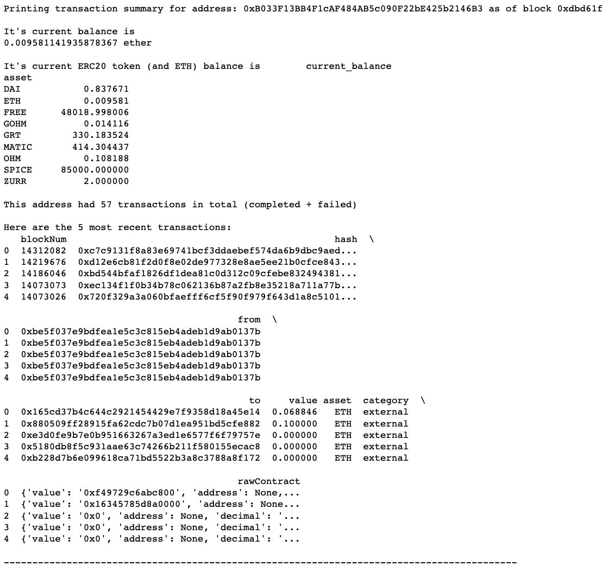

# onchain

Experimenting with on-chain data

Given a list of Ethereum addresses, return a suite of statistics as of the latest block:

- What is the address' Ether balance?
- What is its ERC20 token balance?
- How many transactions (both completed and failed) occurred where the address was sender or recipient?
- Return the transaction history as a Pandas DataFrame

Under the hood, we make use of [Alchemy's API](https://www.alchemy.com/)



## Installation Instructions

Clone the repo:

```{bash}
git clone https://github.com/akan72/onchain
cd onchain
```

To set up our virtual environment for the first time, run `make install` or the following:

```{bash}
python3 -m venv env
source env/bin/activate
python -m pip install --upgrade pip
pip install -r requirements.txt
```

For future runs, we only need to execute `source env/bin/activate`.

Set up your Project ID for using [Alchemy's API](https://docs.alchemy.com/alchemy/) (multiple options):

- Add it to the ALCHEMY_API_KEY variable in `onchain/config.py`

- For use within scripts:

```{bash}
export ALCHEMY_API_KEY=<ALCHEMY_API_KEY>
```

- For use in Jupyter Notebooks

```{bash}
os.environ['ALCHEMY_API_KEY'] = '<ALCHEMY_API_KEY>'
```

## Running the code

Run the script generated using `jupyter nbconvert`:

```{bash}
python3 example.py
```

Run the notebook directly by executing `jupyter notebook` and using the UI.

Deactivate the venv when we're done:

```{bash}
deactivate
```

## Next Steps

- Allow for CLI-based input of addresses. Users would be able to pass
  them in from the command line or through a CSV file.
- CSV output support for the summary DataFrames
- Ability to query transaction history from a custom start block
- Support for ENS lookup instead of just hex addresses
- Support for ENS721 and ERC1155 balances by parsing the relevant contracts
- Make setup easier and create a proper package using `setuptools`
- Implement pagination for transaction history. Right now we're limited to 10,000 results per call
- Add a proper logger instead of using print statements
- Create a dashboard using Streamlit or a simple Flask webapp to display results

## Limitations

- Transaction history results are limited by the API to a max of 10,000 results
  (see Next Steps about pagination)
- Final token balance only currently supports Ether an ERC20 token balances.
  - Other types of transactions are shown within history, but latest balance is omitted.
- Balance for some exotic methods like `contribute` here isn't supported ([Example tx](https://etherscan.io/tx/0x07fc483171eaed8aada2cd8cba878f1fd41832abd8b161fd9cf698d045ee0925))
